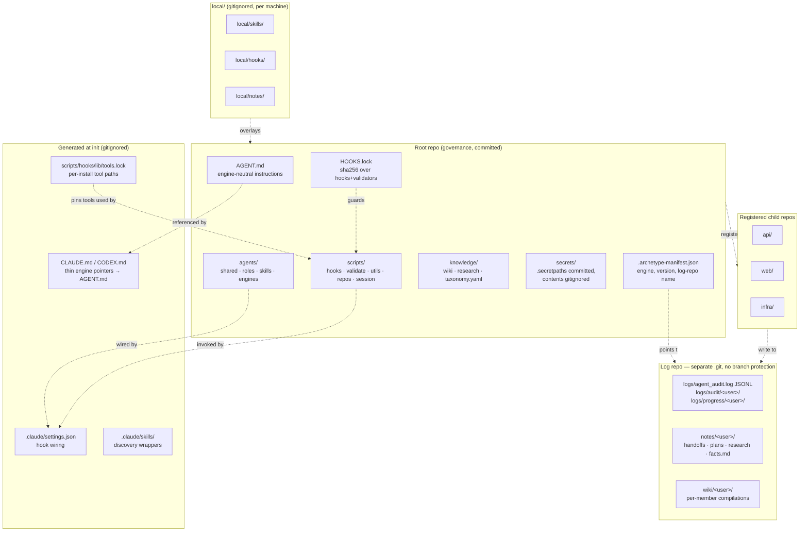
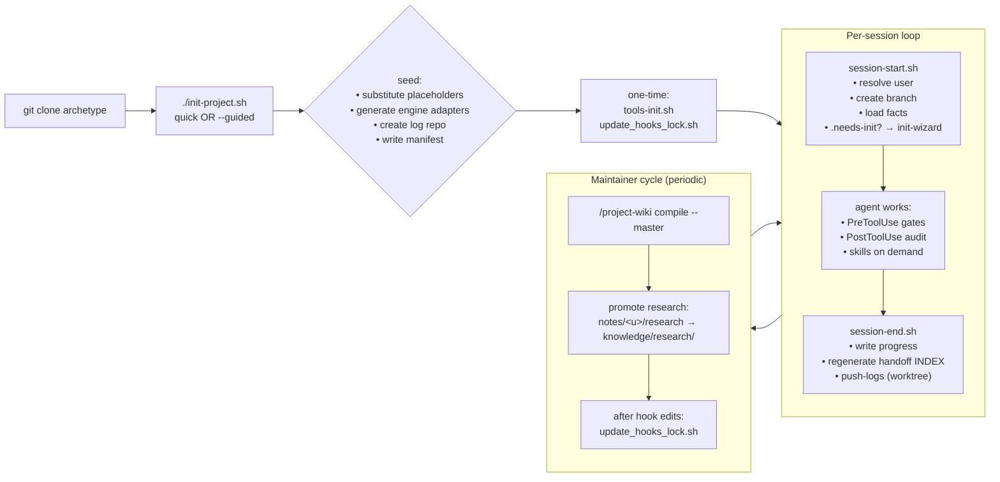
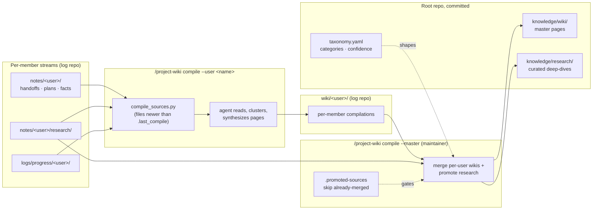

# Root-Archetype — System Architecture & Design Philosophy

A single-page map of the system: what each piece is, how the pieces fit, why the design is shaped this way, and when to reach for it.

> If you want setup commands, start with [README.md](../README.md). If you want subsystem detail, the per-area pages live in [knowledge/wiki/](../knowledge/wiki/). This doc is the bridge between the two — the picture you build once and refer back to.

---

## What this is, in one paragraph

Root-archetype is a **governance scaffold for AI-agent-driven, multi-repo work**. It is not application code; it is the meta-repository that sits *above* application repositories and gives AI agents (Claude Code, Codex, anything that can read a markdown file and run shell hooks) a consistent operating environment: shared roles, hookable safety gates, append-only audit trails, a knowledge-compilation pipeline, and a child-repo registry. Clone it, run `init-project.sh`, and you have a hardened root from which agents can safely work across many repositories without re-inventing per-project policy.

---

## Topology — what lives where



**Reading the diagram:**

- **Root repo** (`{{PROJECT_ROOT}}`) holds *only* engine-neutral, committed governance: agent definitions, hook source, validators, master knowledge, manifests. It contains no application code.
- **Generated layer** is produced by `init-project.sh` per installation. It is the only place engine-specific concerns appear, and it is gitignored — so the same root repo runs unchanged under different engines.
- **Log repo** is a *separate git repository*, created at init time inside `repos/<project>-logs/`. It is where every session writes; per-user paths mean no two users ever touch the same file, so there are no merge conflicts and no need for branch protection.
- **Child repos** are the application code. They are registered (symlinked or placed under `repos/`) and discovered via `.archetype-manifest.json`. They stay self-contained — the root adds *cross-repo awareness*, not coupling.
- **`local/`** is per-machine personalisation: skills you don't want to share, scratch notes, machine-specific hooks. Gitignored end-to-end.

---

## Lifecycle — how a project moves through time



**Key transitions:**

- **Clone → Init** is a single command. Quick mode is < 5 s and ready to use. `--guided` drops a `.needs-init` marker; the next session detects it and triggers the `init-wizard` skill for an interactive setup (repo registration, maintainer list, optional hooks, knowledge seed).
- **One-time hardening** generates the per-installation `tools.lock` and the `HOOKS.lock` registry. This is intentionally separate from init so cloners explicitly opt into security state and re-run the same commands after upgrades.
- **Session loop** is the day-to-day: a session is a branch, hooks gate every tool call, and the session ends with progress written to `logs/progress/<user>/` and pushed to the log repo via a detached worktree (so the agent's branch is not disturbed).
- **Maintainer cycle** is what turns per-user notes into shared knowledge. Maintainers run `/project-wiki compile --master` and review what gets promoted from `notes/<user>/research/` into `knowledge/research/`.

---

## Hook flow — what gates every tool call

```mermaid
flowchart TB
  Tool["Agent issues a tool call"] --> Phase{Phase}

  Phase -->|PreToolUse: Read/Glob/Grep/Bash| ReadGate["check_secrets_read.sh<br/>blocks reads of<br/>secrets/, ~/.ssh/, .env*"]
  Phase -->|PreToolUse: Write/Edit| WriteGate["check_filesystem_path.sh<br/>blocks writes outside<br/>project root"]
  Phase -->|PreToolUse: Write/Edit (optional)| EditGuard["pre-edit-guard.sh<br/>scans content for<br/>credential patterns"]
  Phase -->|PostToolUse| Audit["post-tool-use-audit.sh<br/>append JSONL to<br/>logs/agent_audit.log"]
  Phase -->|SessionStart| SStart["session-start.sh<br/>identity, branch, dirs"]
  Phase -->|SessionEnd| SEnd["session-end.sh<br/>progress, push-logs"]

  ReadGate --> Decision{block / warn / allow}
  WriteGate --> Decision
  EditGuard --> Decision

  subgraph Trust["Hook integrity layer"]
    HUtils["lib/hook-utils.sh<br/>hook_resolve_tool"]
    TLock["lib/tools.lock<br/>(gitignored, per install)"]
    HLock["HOOKS.lock<br/>(committed, sha256s)"]
    Validator["validate_hooks_lock.sh<br/>fails on drift"]
    HUtils --> TLock
    HLock --> Validator
  end

  ReadGate -.uses.-> HUtils
  WriteGate -.uses.-> HUtils
  EditGuard -.uses.-> HUtils
  Audit -.uses.-> HUtils
  SStart -.uses.-> HUtils
  SEnd -.uses.-> HUtils
```

**Why two layers of locks:**

- `tools.lock` is *per-installation* and *gitignored* — it pins absolute paths to `git`, `jq`, `python3`, etc. so a hook can't be subverted by a malicious entry in `$PATH`. It varies by machine, so committing it would constantly conflict.
- `HOOKS.lock` is *committed* — it is a sha256 over every file under `scripts/hooks/` and `scripts/validate/` (excluding `tools.lock`). Any drift in hook source is detected by `validate_hooks_lock.sh`. Re-approval is an explicit `update_hooks_lock.sh` step, treated as a security event.

All hook commands in `.claude/settings.json` use the `${CLAUDE_PROJECT_DIR:-.}/` prefix. This is mandatory: bare relative paths silently fail in worktree and subagent contexts where Claude Code's CWD is not the project root.

---

## Knowledge compilation — from per-user streams to curated wiki



The pipeline is **doubly incremental**: `compile_sources.py` filters by `.last_compile` timestamp, and master compile additionally skips files listed in `.promoted-sources`. `--full` overrides both. The mechanical half (handoff `INDEX.md` regeneration on every session-end) runs unconditionally; the LLM half (clustering, synthesis) runs on demand via the `project-wiki` skill.

---

## Design philosophy — eight principles and what they buy you

Each principle below names the choice it drives and the trade-off it accepts. They are not aspirational — they are visible in the directory layout and the hook source.

### 1. Engine-neutral by default

> "Engine-specific language is forbidden in `AGENT.md` and `agents/roles/` files." — [knowledge/wiki/engine-neutral-architecture.md](../knowledge/wiki/engine-neutral-architecture.md)

`AGENT.md` is the single source of truth and is committed. `CLAUDE.md`, `CODEX.md`, `.claude/settings.json`, `.claude/skills/` are generated at init time from templates under `agents/engines/<engine>/` and gitignored. **Trade-off:** adding a brand-new engine costs you a template directory; in exchange every clone can swap engines without touching committed content.

### 2. Governance ≠ application

The root repo holds policy, hooks, knowledge, and a registry — never application code. Application repos are children, registered via `scripts/repos/register-repo.sh`, and stay self-contained. **Trade-off:** one extra repository in the topology; in exchange the same governance layer can sit above any number of unrelated codebases without coupling them.

### 3. Append-only, per-user storage

> "No two users write to the same file, eliminating merge conflicts and enabling async collaboration." — [knowledge/wiki/knowledge-compilation-pipeline.md](../knowledge/wiki/knowledge-compilation-pipeline.md)

Every persistent path scopes to `<user>` (`logs/progress/<user>/`, `notes/<user>/`, `wiki/<user>/`). The audit log is JSONL — append-only by construction. **Trade-off:** later compilation work is needed to merge per-user streams into shared artifacts; in exchange there is *zero merge contention* during sessions.

### 4. Separate log repo, no branch protection

The log repo is its own git repository under `repos/<project>-logs/`. Sessions push there directly, even when the root repo has required reviews or CI gates on `main`. **Trade-off:** you maintain two repositories; in exchange agents can write logs continuously without ever waiting on review, and the root repo's history stays focused on governance changes.

### 5. Layered, fail-open security

> "Make accidental and adversarial misbehavior visible, bounded, and reversible." — [docs/guides/security.md](guides/security.md)

The defense stack is multiple cheap layers: read gate (`check_secrets_read.sh`), write gate (`check_filesystem_path.sh`), optional pre-edit secret scan, post-tool-use append-only audit, tool pinning, drift detection. Hooks are fail-open — if a prerequisite is missing they exit 0 so a fresh clone is never bricked by setup state. **Trade-off:** a misconfigured hook is silently bypassed rather than blocking the user; explicit hardening (`tools-init.sh`, `update_hooks_lock.sh`) is required to harden a clone. `ARCHETYPE_HOOK_TOOLS_STRICT=1` is the strict-mode escape hatch.

### 6. Tool pinning over `$PATH`

> "If `$PATH` contains an attacker-controlled directory, the hook runs the attacker's binary — bypassing the gate it implements." — [docs/guides/security.md](guides/security.md)

Every hook resolves `git`, `jq`, `python3`, `gh` through `hook_resolve_tool`, which reads pinned absolute paths from `tools.lock`. **Trade-off:** `tools.lock` is per-installation and must be regenerated after toolchain upgrades; in exchange `$PATH` shadowing cannot subvert the safety gates.

### 7. Lean instruction budget

> "Every instruction consumes model attention budget; verbose files increase inference cost by 20%+ without improving success rates. Target: ≤400 words of essential-toolchain." — [agents/shared/ENGINEERING_STANDARDS.md](../agents/shared/ENGINEERING_STANDARDS.md)

Role files and `AGENT.md` are deliberately terse. Background and architecture context lives in the wiki, where agents can read it on demand. **Trade-off:** new contributors might initially want a longer onboarding doc; the philosophy is that agents (and humans) explore better than they parse descriptions, so context belongs in browseable knowledge, not in the prompt.

### 8. Convention + validators, not runtime config

Roles share a 6-section schema. Skills live in `agents/skills/<name>/SKILL.md`. Hooks live under `scripts/hooks/`. Drift is caught by `validate_*` scripts and `HOOKS.lock`, not by a runtime config file that the system reads. **Trade-off:** the structure is opinionated and expects you to follow it; in exchange the system is debuggable by reading the filesystem — no hidden state.

---

## How to use it — three concrete scenarios

### A. Solo researcher, single child repo

```bash
git clone <archetype-url> my-research && cd my-research
./init-project.sh my-research --repos "analysis:/path/to/analysis"
scripts/hooks/lib/tools-init.sh
scripts/validate/update_hooks_lock.sh
# open Claude Code in this directory; hooks are wired, log repo exists, AGENT.md applies
```

You get: per-session branches, an audit trail, filesystem boundaries, and a place (`notes/<user>/research/`) for structured intake. You won't use the multi-user features, but they don't get in the way either.

### B. Small team, multiple child repos, shared knowledge

```bash
./init-project.sh team-platform \
  --repos "api:/path/to/api,web:/path/to/web,infra:/path/to/infra" \
  --guided
# next session triggers init-wizard for maintainer setup, optional hooks, KB seed
```

You get: per-user notes that never collide, a maintainer cycle (`/project-wiki compile --master`) that converts those notes into `knowledge/wiki/`, and a child-repo registry so any agent can `scripts/repos/scan-agents.sh` to discover roles defined across the team's repositories.

### C. Existing project adopting root-archetype mid-flight

```bash
git clone <archetype-url> ../my-project-governance
cd ../my-project-governance
./init-project.sh my-project   # without --repos
scripts/repos/register-repo.sh existing-app /path/to/existing-app --no-scaffold
# Edit .claude/settings.json to enable only the hooks you want initially
# Run tools-init.sh + update_hooks_lock.sh once you've stabilised your hook set
```

`--no-scaffold` keeps the existing repo untouched (no `CLAUDE.md` or role file injection). You can opt into hooks one at a time by editing `.claude/settings.json` — start with `post-tool-use-audit.sh` (zero behavioural impact, gives you visibility) and add gates as the team gets comfortable.

---

## What to use it for — and what not to

**Reach for root-archetype when:**

- You have **multiple repos** that share an AI-agent operating model and you want one place to define roles, policy, and shared knowledge.
- Your work is **knowledge-heavy** (research, engineering, ops): the per-user → master compilation pipeline turns ad-hoc notes into a maintained wiki without forcing everyone to write to the same file.
- You need **agent activity to be auditable**: every tool call gets a JSONL line, every session is a branch, every push is traceable.
- You want **filesystem-level safety** for agent operations on developer workstations: read gates for secrets, write gates for project boundaries, drift detection for the gates themselves.
- You work across **multiple AI engines** (e.g. Claude Code + Codex) and don't want to fork the agent setup per engine.

**Don't reach for it when:**

- You have a **single repo, single agent, single user**, and the operation is one-shot or short-lived. The setup overhead does not pay back.
- You need **kernel-level sandboxing** or **OS-keychain** integration. Both are deliberately out of scope (per-deployment / heterogeneous on Linux); see [docs/guides/security.md](guides/security.md). Root-archetype hardens at the hook layer; full sandboxing is a separate concern.
- Your team **opposes filesystem boundaries or audit overhead** on principle. Most of the value of the archetype is precisely those boundaries; if you turn the hooks off, what remains is "an opinionated directory layout" — useful, but not enough on its own to justify adoption.

---

## See also

Setup, conventions, and per-subsystem reference all live in the existing docs. This page is the entry point; the deep material is one click away:

- [README.md](../README.md) — installation, command tables, structure overview
- [AGENT.md](../AGENT.md) — engine-neutral instructions every agent reads first
- [knowledge/wiki/](../knowledge/wiki/) — 10 reference pages (initialization, engine-neutral architecture, hook governance, security hardening, agent roles & standards, doc governance, knowledge pipeline, operations & audit, multi-repo, skills framework)
- [docs/guides/security.md](guides/security.md) — full threat model, 11 defense layers, setup checklist
- [docs/guides/skills-engineering.md](guides/skills-engineering.md) — designing and adding skills
- [docs/guides/secrets-backend-integration.md](guides/secrets-backend-integration.md) — secrets handling
- [agents/README.md](../agents/README.md) — role schema, shared/roles/skills layout
- [scripts/hooks/README.md](../scripts/hooks/README.md) — per-hook table with enable instructions
